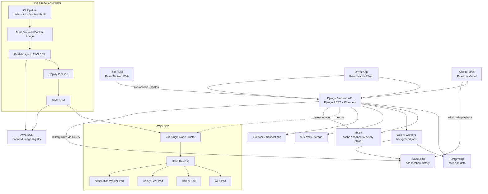

# Locomotion Project Hosting & Infrastructure Documentation

**Version:** 2.0  
**Date:** 2026-03-31  
**Status:** Official Documentation

---

## 1. Executive Summary

This document provides a comprehensive technical overview of the Locomotion project's hosting infrastructure. The platform is built as a multi-service ride marketplace system with a React web frontend, a Django backend, a FastAPI AI service, and an Expo mobile driver application.

The project supports two primary deployment models:

- A unified Docker Compose deployment for local development and single-host operation
- A Helm-based Kubernetes/K3s deployment for production-style backend hosting

The infrastructure uses AWS for media storage and notification queueing, Firebase for push delivery, Redis for cache and messaging, PostgreSQL for transactional data, Qdrant for AI vector search, and Expo EAS for mobile build distribution. The current backend deployment files also show a lightweight K3s hosting model using Traefik, DuckDNS, and cert-manager, with the option to run the AI service either inside the cluster or externally.

---

## 2. Infrastructure Architecture Overview

The application is composed of five main layers:

### A. Frontend Layer

- **Framework:** React 19 with Vite
- **Hosting Style:** Static frontend hosting, suitable for platforms such as Vercel
- **Routing:** Client-side routing with `react-router-dom`
- **Integration:** Connects to the backend through REST APIs and WebSockets
- **Current Deployment Clue:** The backend allowlists include `https://locomotionride.vercel.app`, indicating a deployed web frontend on Vercel or a similar static host

### B. Backend & Realtime Layer

- **Framework:** Django 6 + Django REST Framework
- **Serving Mode:** ASGI via Daphne
- **Reverse Proxy:**
  - Docker mode: Nginx
  - K3s mode: Traefik ingress
- **Background Workers:** Celery, Celery Beat, and a dedicated notification worker
- **Realtime:** Django Channels with Redis for WebSocket communication

### C. AI Service Layer

- **Framework:** FastAPI
- **Purpose:** Driver matching and driver earnings coaching
- **Vector Database:** Qdrant
- **Embedding Model:** `all-MiniLM-L6-v2`
- **LLM Providers:** Gemini or Groq
- **Scalability Mode:** Can run:
  - inside Docker Compose
  - inside Kubernetes via Helm
  - externally, with Django pointing to a hosted AI endpoint

### D. Data & Storage Layer

- **Primary Database:** PostgreSQL
- **Cache / Broker / Channel Layer:** Redis
- **Object Storage:** AWS S3 for uploaded media
- **Notification Queue:** AWS SQS
- **Push Delivery:** Firebase Cloud Messaging

### E. Mobile Distribution Layer

- **Framework:** Expo React Native
- **Build & Distribution:** Expo EAS
- **Purpose:** Driver-side mobile operations, ride handling, and live location publishing

---

## 3. Detailed Hosting Architecture

### A. Web Frontend

- **Application:** `Locomotion React/Locomotion React`
- **Build Tool:** Vite
- **Recommended Hosting:** Vercel, Netlify, Nginx, or S3 + CloudFront
- **Backend Communication:**
  - `VITE_API_ORIGIN`
  - `VITE_AI_ORIGIN`
- **Push Notifications:** Firebase Web Messaging with `firebase-messaging-sw.js`
- **Realtime Tracking:** WebSocket connection to `/ws/location/<ride_id>/`

### B. Backend Application

- **Application:** `Locomotion/Locomotion`
- **Core Runtime:** Django + DRF + Channels + Celery
- **Containerization:** Docker
- **Single-host Reverse Proxy:** Nginx container
- **Cluster Ingress:** Traefik or Nginx ingress, depending on Helm values
- **API Documentation:** Swagger and ReDoc served by Django

### C. AI Application

- **Application:** `Locomotion/ai_service`
- **Purpose:**
  - semantic driver retrieval
  - retrieval-first driver recommendations
  - AI-generated driver coach plans
- **Hosting Modes:**
  - local Docker container
  - Kubernetes deployment with optional HPA
  - external endpoint referenced by `AI_SERVICE_URL`

### D. Worker Services

- **Celery Worker:** Handles async backend tasks
- **Celery Beat:** Handles periodic scheduled jobs
- **Notification Worker:** Polls AWS SQS and sends Firebase notifications

### E. Data Services

- **PostgreSQL:** Stores users, driver profiles, vehicles, rides, payments, notifications, and chat
- **Redis:** Used for:
  - Django cache
  - Channels layer
  - Celery broker
- **Qdrant:** Stores driver embeddings for AI retrieval

---

## 4. Deployment Models in This Project

### 4.1 Docker Compose Deployment

This is the core local development and single-server hosting mode already implemented in `Locomotion/Locomotion/docker-compose.yml`.

**Services included:**

- `web` - Django ASGI application
- `celery` - Celery worker
- `celery-beat` - Celery scheduler
- `notification-worker` - SQS to Firebase notification bridge
- `db` - PostgreSQL 15
- `redis` - Redis
- `qdrant` - vector database
- `fastapi-ai` - FastAPI AI service
- `nginx` - reverse proxy

**Key configuration excerpt:**

```yaml
services:
  web:
    build: .
    command: daphne -b 0.0.0.0 -p 8000 Locomotion.asgi:application

  celery:
    build: .
    command: celery -A Locomotion worker --loglevel=info --pool=solo

  celery-beat:
    build: .
    command: celery -A Locomotion beat -l info

  fastapi-ai:
    build:
      context: ../ai_service

  nginx:
    build: ./nginx
    ports:
      - "80:80"
```

**Integration model:**

- Nginx routes `/api/` to Django
- Nginx routes `/api/ai/` to FastAPI
- Nginx upgrades `/ws/` traffic for live location tracking
- Django talks to Redis, PostgreSQL, S3, SQS, and AI service containers internally

### 4.2 Helm / Kubernetes Deployment

The canonical Kubernetes deployment path is under:

```text
Locomotion/Locomotion/helm/locomotion
```

**What the chart supports:**

- Django web deployment
- Celery worker
- Celery Beat
- Notification worker
- FastAPI AI deployment
- Optional PostgreSQL
- Optional Redis
- Optional Qdrant
- Ingress
- Migration job
- HPA for web and AI workloads

### 4.3 Current K3s Backend Deployment Pattern

The file `values-k3s-backend.yaml` shows the current lightweight cluster-style backend deployment.

**Key characteristics:**

- **Cluster Type:** K3s
- **Ingress:** Traefik
- **TLS:** cert-manager with `letsencrypt-prod`
- **Public API Host:** `locomotion-api.duckdns.org`
- **Web Frontend Allowlist Includes:** `https://locomotionride.vercel.app`
- **Storage Class:** `local-path`
- **Bundled Services Enabled:** PostgreSQL and Redis
- **Bundled Services Disabled:** in-cluster FastAPI AI and Qdrant
- **AI Mode:** backend points to an external AI endpoint through `aiServiceUrl`

This means the current backend hosting pattern is a hybrid model:

- Django and workers are hosted in K3s
- PostgreSQL and Redis can run in-cluster
- AI can be hosted outside the cluster
- the web frontend is hosted separately

### 4.4 Lightweight Free-Tier K3s Mode

The file `values-k3s-free.yaml` defines a reduced-resource deployment:

- single web replica
- no Celery worker
- no Celery Beat
- no notification worker
- no in-cluster FastAPI AI
- no Qdrant

This mode is intended for:

- low-memory VPS hosting
- demo environments
- backend-only lightweight deployments

### 4.5 Production-Style Cluster Mode

The file `values-production.example.yaml` describes a fuller production approach:

- registry-hosted immutable images
- multiple backend replicas
- autoscaling enabled
- managed PostgreSQL / Redis / Qdrant expected externally
- TLS ingress enabled
- secret references instead of inline values

---

## 5. Backend Configuration (Locomotion Django)

**Deployment Platform:** Docker container or Kubernetes pod  
**Primary Entry Point:** Daphne ASGI server

### Key Components

1. **ASGI & Realtime**
   - Daphne serves Django as an ASGI app
   - Channels provides WebSocket support
   - Redis powers the channel layer

2. **Authentication**
   - JWT with refresh token support
   - email OTP verification
   - Google Sign-In
   - TOTP-based 2FA

3. **Storage**
   - Local filesystem media in development
   - S3-backed media in hosted environments

4. **Security**
   - environment-driven `ALLOWED_HOSTS`
   - environment-driven CORS and CSRF allowlists
   - secure cookie and proxy settings for hosted mode

5. **API Documentation**
   - `/swagger/`
   - `/redoc/`
   - `/swagger.json`
   - `/swagger.yaml`

---

## 6. AI Service Configuration (FastAPI + Qdrant)

**Deployment Platform:** Docker container, Kubernetes pod, or external hosted endpoint

### Responsibilities

- Sync driver profile text into Qdrant
- Retrieve best driver matches for natural-language rider queries
- Generate coach plans for drivers using LLMs
- Fall back to deterministic logic if the LLM is unavailable

### Core Configuration

- `QDRANT_URL` or `QDRANT_HOST` + `QDRANT_PORT`
- `GEMINI_API_KEY`
- `GROQ_API_KEY`
- `LLM_PROVIDER`
- CORS allowlist via `ALLOWED_ORIGINS`

### Reliability Pattern Already Implemented

The Django backend does not fully depend on the AI service being healthy at all times.

**Implemented safeguards:**

- retries to alternate AI base URLs
- avoidance of proxy-induced HTML error pages where possible
- local fallback coach-plan generation when the AI service is unavailable
- retrieval-first matching so the AI layer remains useful even without an LLM response

---

## 7. AWS S3 Configuration (Object Storage)

**Purpose:** Stores uploaded media and driver-related files.

**Used For:**

- user profile images
- driver profile images
- driver application documents
- vehicle images
- RC and insurance documents

**Current Bucket Reference in Deployment Values:** `locomotion-media`

### Django Integration

- Uses `django-storages[s3]` and `boto3`
- Controlled through:
  - `USE_S3`
  - `AWS_ACCESS_KEY_ID`
  - `AWS_SECRET_ACCESS_KEY`
  - `AWS_STORAGE_BUCKET_NAME`
  - `AWS_REGION`
  - `AWS_MEDIA_URL_EXPIRE_SECONDS`
  - `AWS_QUERYSTRING_AUTH`

### Access Pattern

Unlike a purely public static bucket model, Locomotion supports signed media URL behavior through Django settings. This allows media access policy to be tightened if needed.

---

## 8. Notifications Infrastructure (AWS SQS + Firebase)

**Purpose:** Delivers ride, chat, and status-change notifications to web and mobile clients.

### Flow

1. Django stores device tokens in `FCMDevice`
2. Django creates notification records in the database
3. Django pushes notification jobs to AWS SQS
4. `notification_worker.py` long-polls the queue
5. Firebase Admin sends the push message to target devices

### Services Used

- **AWS SQS:** queue buffer for notification jobs
- **Firebase Admin SDK:** actual push delivery
- **Firebase Web Messaging:** browser push on the web frontend

### Relevant Configuration

- `AWS_SQS_QUEUE_URL`
- `AWS_REGION` / `AWS_SQS_REGION`
- `FIREBASE_SERVICE_ACCOUNT_PATH`
- Kubernetes Firebase secret mount for the notification worker

### Reliability Details

The notification worker includes protection against permanently invalid FCM tokens by dropping messages for unrecoverable token errors instead of endlessly retrying them.

---

## 9. Redis & Background Task Infrastructure

**Redis roles in Locomotion:**

- Django cache backend
- Channels layer backend
- Celery broker

**Celery tasks currently used for:**

- sending OTP emails
- purging stale unverified accounts
- auto-cancelling stale rides
- AI sync jobs for drivers
- scheduled coach reminders

**Schedulers and worker types:**

- Celery worker
- Celery Beat
- notification worker

---

## 10. Mobile App Infrastructure

**Application:** `LocomotionMobile`  
**Framework:** Expo Router + React Native

### Hosting/Distribution Model

The mobile app is distributed rather than hosted as a website.

**Build system:**

- Expo EAS

**Build profiles already defined:**

- `development`
- `preview`
- `production`

### Mobile Runtime Integrations

- Django API for authentication and ride actions
- WebSocket channel for live location publishing
- Google Sign-In
- Expo Secure Store for token storage
- Google Maps integration on Android

### Important Operational Note

Native Google Sign-In requires a development build or production build. It is not intended to be tested through plain Expo Go.

---

## 11. Problems Faced & Solutions

### Problem 1: Cross-Origin Auth, Cookies, and CSRF Between Frontend and API

**Issue:** The frontend and backend are deployed on separate origins, such as a Vercel-hosted frontend and a DuckDNS-hosted backend API. This creates risk around cookies, CSRF trust, and authenticated API access.

**Solution:**

1. Backend settings are fully environment-driven for:
   - `CORS_ALLOWED_ORIGINS`
   - `CSRF_TRUSTED_ORIGINS`
   - secure cookie behavior
2. The React app uses `withCredentials: true` and token refresh handling
3. The K3s backend values explicitly include deployed frontend origins, including the production web domain
4. Hosted mode can use `SameSite=None` where required by cross-site browser behavior

### Problem 2: AI Service Startup Delays and Proxy-Level 502 Errors

**Issue:** The FastAPI AI service loads embedding models and can be slower to become ready. Routing backend-to-backend traffic through a proxy may also produce transient HTML error pages or 502 responses.

**Solution:**

1. Django tries direct internal AI service URLs before relying on a proxy path
2. The backend performs retries before failing
3. Coach plan generation falls back to a deterministic local planner
4. The K3s backend mode can point to an external AI endpoint when in-cluster AI is disabled

### Problem 3: WebSocket Connectivity Through Reverse Proxies

**Issue:** Live tracking requires WebSocket upgrade support, which commonly breaks when the proxy layer is not configured correctly.

**Solution:**

1. Nginx explicitly proxies `/ws/` with upgrade headers in Docker mode
2. Django Channels handles ride-scoped WebSocket rooms
3. Redis provides the shared messaging layer

### Problem 4: Mobile Same-Network Development Friction

**Issue:** When testing the mobile app on a physical device, local IP changes break API access.

**Solution:**

1. Local API origins are environment-driven instead of being hardcoded across the repo
2. When your LAN IP changes, update the relevant local `.env` or Expo configuration values for backend, frontend, and mobile clients

### Problem 5: Push Notification Reliability Across Multiple Devices

**Issue:** Users may sign in on multiple devices, and stale tokens can cause queue noise or failed notification attempts.

**Solution:**

1. The backend stores multiple device tokens through the `FCMDevice` model
2. Notifications can be fanned out to all active tokens
3. The worker deletes unrecoverable FCM jobs for invalid tokens

---

## 12. Deployment Commands & Operations

### 12.1 Docker Compose Deployment

**From the backend directory:**

```powershell
cd "c:\Users\user1\Desktop\L\Locomotion\Locomotion"
docker compose up --build
```

**Common operations:**

```powershell
docker compose up -d
docker compose logs -f web
docker compose logs -f fastapi-ai
docker compose exec web python manage.py migrate
docker compose exec web python manage.py collectstatic --noinput
```

### 12.2 Build Backend and AI Images Manually

**From repo root:**

```powershell
docker build -t locomotion-web .\Locomotion\Locomotion
docker build -t locomotion-fastapi-ai .\Locomotion\ai_service
```

These images can then be pushed to the registry used by your Helm deployment.

### 12.3 Helm / K3s Deployment

**Example install:**

```bash
helm upgrade --install locomotion ./helm/locomotion \
  --namespace locomotion \
  --create-namespace \
  -f ./helm/locomotion/values-k3s-backend.yaml
```

**Production-style example:**

```bash
helm upgrade --install locomotion ./helm/locomotion \
  --namespace locomotion \
  --create-namespace \
  -f ./helm/locomotion/values-production.example.yaml
```

### 12.4 React Frontend Build

```powershell
cd "c:\Users\user1\Desktop\L\Locomotion React\Locomotion React"
npm install
npm run build
```

### 12.5 Mobile EAS Build

```bash
cd "c:\Users\user1\Desktop\L\LocomotionMobile"
eas build --profile preview --platform android
```

### 12.6 Database Management

**Docker mode:**

```powershell
docker compose exec web python manage.py migrate
```

**Kubernetes mode:**

Migration is handled through the chart's migration job, but manual pod-based migration can still be run if required.

---

## 13. Environment Variables & Secret Management

### Backend

**Core application and security:**

- `DJANGO_ENV`
- `DEBUG`
- `DJANGO_SECRET_KEY`
- `ALLOWED_HOSTS`
- `CORS_ALLOWED_ORIGINS`
- `CSRF_TRUSTED_ORIGINS`

**Database and Redis:**

- `POSTGRES_DB`
- `POSTGRES_USER`
- `POSTGRES_PASSWORD`
- `POSTGRES_HOST`
- `POSTGRES_PORT`
- `REDIS_CACHE_URL`
- `CHANNEL_REDIS_URL`
- `CELERY_BROKER_URL`

**External integrations:**

- `AWS_ACCESS_KEY_ID`
- `AWS_SECRET_ACCESS_KEY`
- `AWS_STORAGE_BUCKET_NAME`
- `AWS_SQS_QUEUE_URL`
- `FIREBASE_SERVICE_ACCOUNT_PATH`
- `GEMINI_API_KEY`
- `GROQ_API_KEY`
- `RAZORPAY_KEY_ID`
- `RAZORPAY_KEY_SECRET`
- `ORS_API_KEY`

### React Frontend

- `VITE_API_ORIGIN`
- `VITE_AI_ORIGIN`
- `VITE_FIREBASE_API_KEY`
- `VITE_FIREBASE_AUTH_DOMAIN`
- `VITE_FIREBASE_PROJECT_ID`
- `VITE_FIREBASE_STORAGE_BUCKET`
- `VITE_FIREBASE_MESSAGING_SENDER_ID`
- `VITE_FIREBASE_APP_ID`
- `VITE_FIREBASE_VAPID_KEY`
- `VITE_GOOGLE_CLIENT_ID`

### Mobile App

- `EXPO_PUBLIC_API_BASE_URL`
- `EXPO_PUBLIC_GOOGLE_WEB_CLIENT_ID`
- `EXPO_PUBLIC_GOOGLE_ANDROID_CLIENT_ID`
- `EXPO_PUBLIC_GOOGLE_IOS_CLIENT_ID`
- `EXPO_PUBLIC_GOOGLE_MAPS_ANDROID_API_KEY`

### Secret Handling Recommendation

- use `.env` locally
- use Kubernetes secrets in cluster deployments
- avoid committing real credentials into Helm values or tracked config files

---

## 14. External Services Integration

| Service | Purpose | Configuration Location |
| :--- | :--- | :--- |
| **PostgreSQL** | Primary relational database | `.env`, Helm values, `settings.py` |
| **Redis** | Cache, channel layer, Celery broker | `.env`, Docker Compose, Helm values |
| **AWS S3** | Media storage | `.env`, Helm values, `settings.py` |
| **AWS SQS** | Notification queue | `.env`, Helm values, notification worker |
| **Firebase** | Push notification delivery | Firebase secret, web frontend, worker |
| **Qdrant** | Vector database for driver retrieval | Docker Compose, Helm values, AI env |
| **Gemini / Groq** | LLM providers for AI summaries and coaching | `.env`, Helm secrets |
| **Razorpay** | Driver wallet recharge flow | `.env`, `payments/views.py` |
| **OpenRouteService** | Fare calculation and route distance/time | `.env`, `bookings/views.py` |
| **DuckDNS** | Public API hostname | `values-k3s-backend.yaml` |
| **cert-manager** | TLS certificate automation in K3s | ingress annotations in Helm values |
| **Expo EAS** | Mobile build and distribution | `LocomotionMobile/eas.json` |

---

## 15. Recommended Production Setup

For a stable production deployment, the recommended model is:

### Frontend

- Host the React app on Vercel or another static edge host

### Backend

- Deploy Django, Celery, Beat, and notification worker via Helm on K3s or Kubernetes

### Database and Messaging

- Use managed PostgreSQL if available
- Use managed Redis if available

### Storage and Notifications

- Use S3 for media
- Use SQS + Firebase for notification delivery

### AI

- Run FastAPI + Qdrant in-cluster when resources allow
- or point Django to an external AI endpoint when cluster size is limited

---

## 16. Production Checklist

- `DEBUG=False`
- `DJANGO_SECRET_KEY` stored securely
- production domains added to `ALLOWED_HOSTS`
- production frontend origins added to CORS and CSRF settings
- TLS configured on public ingress
- S3 bucket configured and reachable
- SQS queue configured and reachable
- Firebase service account secret mounted correctly
- Redis persistence and connectivity verified
- PostgreSQL persistence and backups verified
- AI endpoint health verified
- WebSocket location tracking tested through the real ingress path
- web push and mobile notifications tested end-to-end

---

## 17. Conclusion

Locomotion is hosted as a modular ride-platform stack that can operate in both simple and scalable modes:

- Docker Compose for unified local and single-host deployment
- Helm + K3s for production-style backend orchestration
- separate static hosting for the React frontend
- Expo EAS for mobile distribution
- AWS-backed storage and queue integrations
- optional internal or external AI hosting

This gives the project a practical hybrid infrastructure model: lightweight enough for a single-host setup, but structured enough to scale into a cluster-backed deployment when traffic and service load increase.

---

**End of Documentation**  
*Maintained for the Locomotion project*


